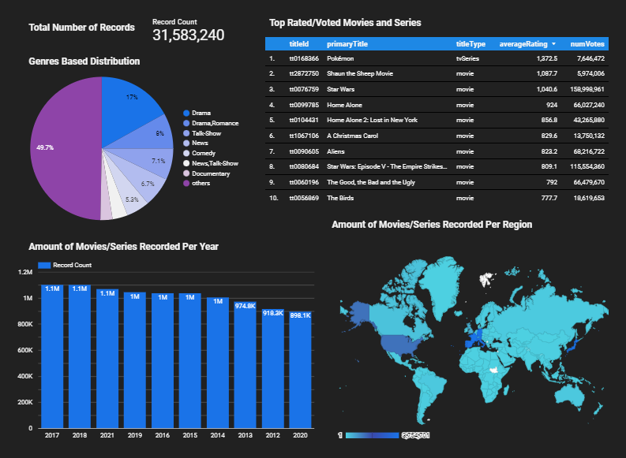

# Data Visualisation

Now we have our transformed data in production. We can use that for building dashboards. There are plenty of visualisation tools (like Tableau, Google Data Studio, Metabase, PowerBI etc…) available. For this project, I have used **Google Data Studio**. If you like to proceed with the same, Kindly follow the below steps!!  

- The first step is to log in to the [Google Data Studio](https://www.googleadservices.com/pagead/aclk?sa=L&ai=DChcSEwji7tX63PX2AhWxmWYCHSw5Dq8YABAAGgJzbQ&ohost=www.google.com&cid=CAESbOD2gwK2VONF32m-jAp9gbo1O5D7xWGqnQyI4hCnIKcxXEmC9Ne_FULZuJU0axi_P3wf9sV7UKa4X3_W7qiAA6dvxy3eVQiErsVZPQlxxqpUfxG7-IN7rgIBbN9fNTHP-PL4anWH4szx6XZ8OA&sig=AOD64_15ynr6t8cS3UknQLRKFFlGxcG5BQ&q&adurl&ved=2ahUKEwjlgtD63PX2AhW8RmwGHXEQBIkQ0Qx6BAgDEAE) and create a data source by choosing BigQuery.
- Next, Select your GCP projectID, Schema(e.g. production) and table(e.g. facttitletable) to connect to this data source.
- Once the connection is established, An Untitled report will open with a sample graph or table. We can delete the sample and provide a name to the report(e.g. IMDb Analysis).
- I have created the below five tiles to show in the dashboard:
  - Total number of records
  - Top rated/voted movies and series
  - Genres based distribution
  - Amount of records per year
  - Amount of records per region

## Final Dashboard
You can also check out to the below final Dashboard 

**_Congratulations, Now we have successfully created our final dashboard!!._**
