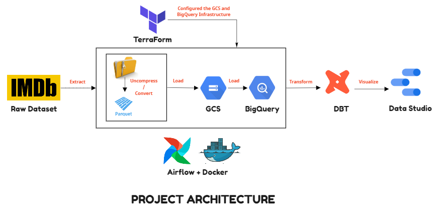

# ProjectIMDb
An End-to-End Data Engineering Project using the IMDb datasets and by utilizing tools like Google Cloud Platform (GCP), Terraform, Airflow, Docker, and DBT!

## Project Description

### Problem Statement

The Internet Movie Database (IMDb) is the world's most popular and the largest authoritative source for movie, TV and celebrity content, designed to help fans explore the world of movies and shows. But the challenging part about the IMDb data is they are divided and stored into multiple files in which each file will have only the certain amount of information.

### Solution

To address the above problem, We are building this project solution using the best practices of Data Engineering. Our objective is to have one final desired table in the data warehouse which will have entire information and make it available for both advanced analytics and visualisations by following the below steps!

- Configure the Project Infrastructure using **Terraform**. Please check out the instructions [here](https://github.com/SanjayV28/ProjectIMDb/blob/74b124e6053cc58b4b22fc36df9c0c6198ae7ae7/terraform/readme.md).
- Create a data pipeline using **Airflow** for processing the dataset, uploading it to the datalake, moving the data from the data lake to the data warehouse and create an external and partitioned/clustered tables. Please check out the instructions [here](https://github.com/SanjayV28/ProjectIMDb/blob/74b124e6053cc58b4b22fc36df9c0c6198ae7ae7/airflow/readme.md).
- Transform the data in the data warehouse using **Data Build Tool(DBT)** and prepare it for analytics and visualisations. Please check out the instructions [here](https://github.com/SanjayV28/ProjectIMDb/blob/74b124e6053cc58b4b22fc36df9c0c6198ae7ae7/dbt/readme.md).
- Created a dashboard using **Google Data Studio**. Please check out the instructions [here](https://github.com/SanjayV28/ProjectIMDb/blob/74b124e6053cc58b4b22fc36df9c0c6198ae7ae7/datastudio/readme.md).

### Architecture


### Dataset
This is a subsets of IMDb data are available for access to customers for personal and non-commercial use. The data is refreshed daily. The dataset files can be accessed and downloaded [here](https://datasets.imdbws.com/.)

#### Dataset Details
Each dataset is contained in a gzipped, tab-separated-values (TSV) formatted file in the UTF-8 character set. The first line in each file contains headers that describe what is in each column. A ‘\N’ is used to denote that a particular field is missing or null for that title/name. The available datasets are as follows:

- **title.akas.tsv.gz** - This dataset contains the following information for titles: titleId, ordering, title, region, language, types, attributes, and isOriginalTitle.
- **title.basics.tsv.gz** - This dataset contains the following information for titles: tconst, titleType, primaryTitle, originalTitle, isAdult, startYear, endYear, runtimeMinutes, and genres.
- **title.episode.tsv.gz** – This dataset contains the following information for tv episode: tconst, parentTconst, seasonNumber, and episodeNumber.
- **title.ratings.tsv.gz** – This dataset contains the information about the IMDb rating and votes information for titles: tconst, averageRating, and numVotes.

Please check out this link [here](https://www.imdb.com/interfaces/) for additional information.

### Technologies
  - Cloud : **Google Cloud Platform (GCP)**
  - Infrastructure as code (IaC): **Terraform**
  - Containerization : **Docker, Docker Compose**
  - Workflow orchestration: **Airflow**
  - Data Lake: **Google Cloud Storage (GCS)**
  - Data Warehouse:  **Google BigQuery**
  - Transformation: **Data Build Tool (DBT)**
  - Visualisation: **Google Data Studio**

### Final Dashboard


### Project Prerequisites

Before starting with the project, you'll need to have the following tools installed on your computer,
 - Docker and Docker-Compose
   - The first step is to install Docker [here](https://docs.docker.com/get-docker/) and follow the instructions for your OS.
   - Next, You can install Docker-Compose [here](https://docs.docker.com/compose/install/) and follow the instructions for your OS.
 - Terraform
   - You can install Terraform [here](https://www.terraform.io/downloads) for your OS.
 - Google Cloud Platform
   - Creating GCP account and setting up access
     - Create a free GCP account using your personal/work Google email id [here](https://console.cloud.google.com/freetrial?_ga=2.76083285.1133969509.1649052192-261372602.1649052192&_gac=1.262941368.1649052192.EAIaIQobChMI0520t9359gIVkJlmAh0wSgm_EAAYASAAEgK5aPD_BwE)
     - Create a new Project by providing the Project Name and Project ID
     - Create a service account and authentication 
       - We will create a new service account for this project services and grant `Storage Admin`,`Storage Object Admin`, `BigQuery Admin` and `Viewer` roles to it.
       - Next, create a json key for authenticating the service account and download it to your local.
     - Install Google Cloud SDK [here](https://www.googleadservices.com/pagead/aclk?sa=L&ai=DChcSEwjimev04vn2AhUcmmYCHaYvBT4YABAAGgJzbQ&ohost=www.google.com&cid=CAASJeRojOrZ3NBL_Vi9AKUmGAT2SDAuRntj1A3D2SqX2_zmMWceeR0&sig=AOD64_3s-vO40cV94ShXol65zNfN7kytqA&q&adurl&ved=2ahUKEwiAw-T04vn2AhXAlNgFHds5DjUQ0Qx6BAgCEAE)
     - set Environment Variable and authenticate sdk
       ```
       export GOOGLE_APPLICATION_CREDENTIALS = "_path to the downloaded json jey file_"
       
       gcloud auth application-default login
       ```
     - Enable the below APIs for your GCP services
       - https://console.cloud.google.com/apis/library/iam.googleapis.com
       - https://console.cloud.google.com/apis/library/iamcredentials.googleapis.com     - Clone this git repository 
       ```
       git clone https://github.com/SanjayV28/ProjectIMDb.git && cd ProjectIMDb
       ```
     
**_Now you have successfully completed the Project Prerequisites, you can start with the project solution!!_**

### Next steps

Now we have successfully completed the project, We can make the below improvements for exploring more!!
- Stream Processing over Batch to consume data in real time using Kafka.
- Try other cloud services like AWS and Azure.
- Check data quality by testing the essential test cases.  
- Try using Cloud specific tools like Dataproc and Cloud Composer etc.

